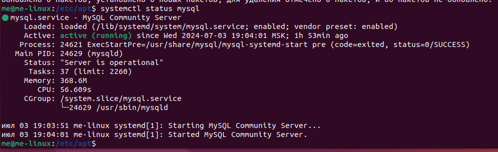

### Задание 

#### Операционные системы и виртуализация (Linux)

1. Использование команды cat в Linux
   - Создать два текстовых файла: "Pets"(Домашние животные) и "Pack animals"(вьючные животные), используя команду `cat` в терминале Linux. В первом файле перечислить собак, кошек и хомяков. Во втором — лошадей, верблюдов и ослов.
   - Объединить содержимое этих двух файлов в один и просмотреть его содержимое.
   - Переименовать получившийся файл в "Human Friends"(.

*Пример конечного вывода после команды “ls” :
Desktop Documents Downloads  HumanFriends.txt  Music  PackAnimals.txt  Pets.txt  Pictures  Videos*

Cоздаем и записываем файлы и данные:
``` bash
cat>Pets
cat>Pack_animals
```
Объеденяем файлы:
``` bash
cat Pets Pack_animals >all
```
Просмотриваем содержимое созданного файла и переименовывем:
``` bash
cat all
mv all Human_Friends
```
Конечный вывод:
``` bash
ls
```


2. Работа с директориями в Linux
   - Создать новую директорию и переместить туда файл "Human Friends".
 
 ``` bash
mkdir newdir      
mv Human_Friends newdir
```


3. Работа с MySQL в Linux. “Установить MySQL на вашу вычислительную машину”
   - Подключить дополнительный репозиторий MySQL и установить один из пакетов из этого репозитория.

Создаем файл и прописываем в нем ссылку на обновления:
 ``` bash
 cd /etc/apt                       
sudo nano sources.list.d/sql.list  
```
Ссылка:

deb http://repo;mysql.​com/apt/debian/stretch mysql-8.0

Установливаем пакет и проверяем результат установки:
 ``` bash
 sudo apt update            
sudo apt install mysql-server  
systemctl status mysql
```


4. Управление deb-пакетами
   - Установить и затем удалить deb-пакет, используя команду `dpkg`.
   
 Устанавливаем пакет и зависимости:
``` bash
sudo dpkg -i /home/me/Загрузки/Yandex.deb 
sudo apt -f install
```
Удаляем пакет и зависимости:
``` bash
sudo apt purge yandex-browser-stable 
sudo apt autoremove 
```


5. История команд в терминале Ubuntu
   - Сохранить и выложить историю ваших терминальных команд в Ubuntu.


В формате: Файла с ФИО, датой сдачи, номером группы(или потока)